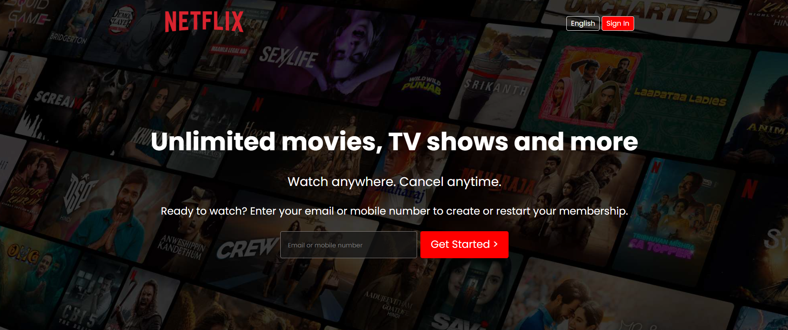

<h1 align="center" style="margin-bottom: 0;">Hey there! 👋</h1>


# Netflix Clone 🎬

Welcome to the **Netflix Clone** project! 🚀  
This is a responsive clone of the Netflix homepage using **HTML** and **CSS**. It mimics the Netflix landing page with interactive components and a clean design. It’s a great project to practice and learn more about frontend development and web design!

---
## Preview 📸

Here’s a preview of the project:



---


## Demo 🌐

Check out the live demo of this project [here](https://github.com/iTusharyadav/mirror-matrix/tree/main/netflix-clone).  

---

## Features ✨

- **Responsive Design**: Fully responsive layout for desktop, tablet, and mobile devices.
- **Interactive Buttons**: Features like the "Sign In" button and email input that mimic the original Netflix site.
- **Clean UI**: Modern UI with smooth animations and hover effects.
- **Content Sections**: Multiple sections like "Enjoy on Your TV", "Watch Everywhere", "For Kids", and more.

---

## Technologies Used 🛠️ 

Here’s a list of technologies used in this project:

- 
- 
- 


---

## Installation Guide :book:

To get a local copy of this project up and running, follow these simple steps:

1. Clone the repository:
   
   ```bash
   git clone git clone https://github.com/iTusharyadav/mirror-matrix.git

---
## Contribution Guidelines 🤝
We welcome contributions to improve this project. Here's how you can help:

1. Fork the repository.
2. Create a new branch (`git checkout -b feature-branch`).
3. Make your changes.
4. Commit your changes (`git commit -m 'Add new feature'`).
5. Push to the branch (`git push origin feature-branch`).
6. Create a pull request.

---
## License 📜

This project is licensed under the MIT License. See the 
[LICENSE](https://github.com/iTusharyadav/mirror-matrix/blob/main/LICENSE) file for details.

---
<p align="center"> "Happy Coding! ✨" </p> 
